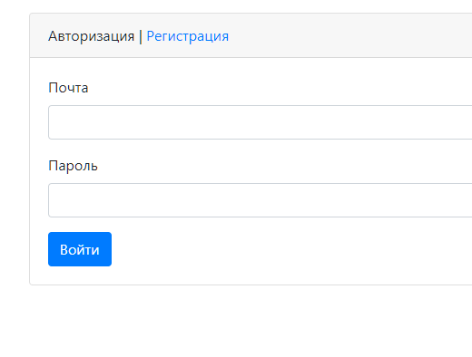

# Dream Job

This is learning project based on JSP and Java Servlets ideology.
It is just like simple vacancy site.
Here are some splash screens. 

### Login page

### Registration page

### List of vacancies

### List of candidates

>to be continued.
>>Or, more probably - not to be ))